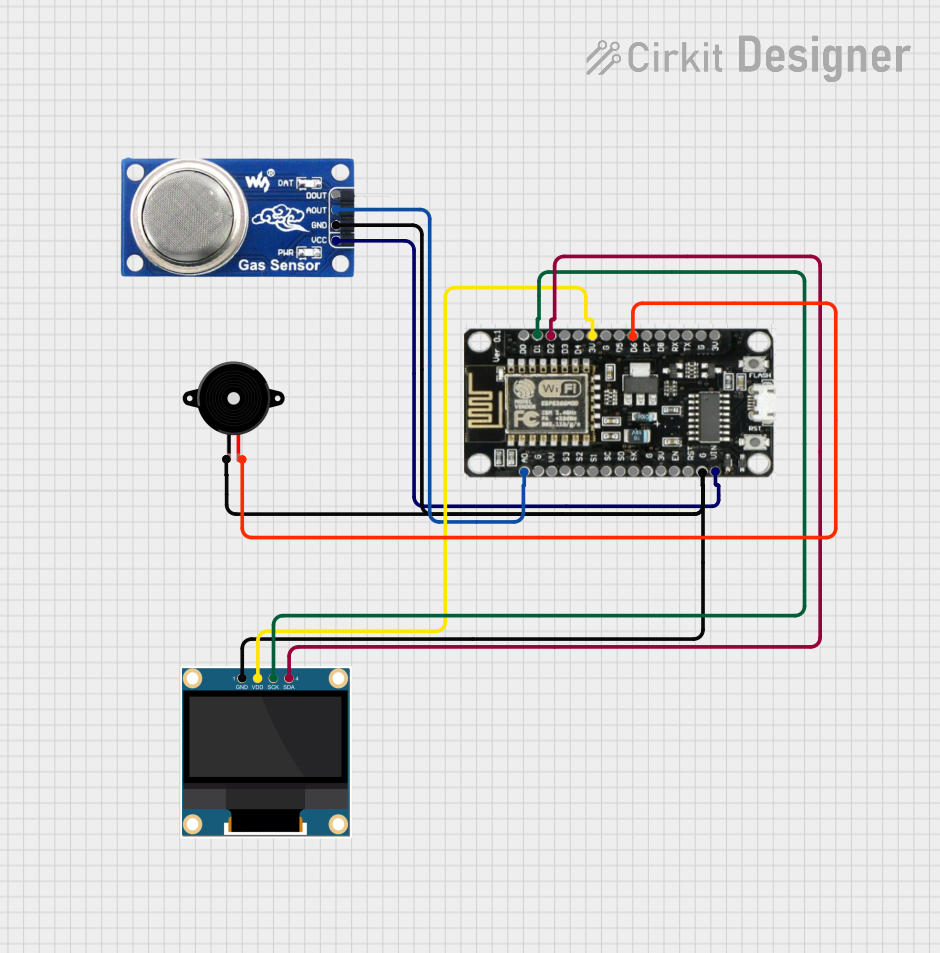

<p align="center">
  
</p>

<p align="center">
  
  
  
  
</p>

<div align="center">    
  <h1>Gas Leak Detector — ESP8266 Firmware</h1>

  <p>
    Arduino firmware for the NodeMCU ESP-12E (ESP8266).<br/>
    Reads MQ-6 gas levels, displays real-time PPM on an OLED,<br/>
    triggers a buzzer on threshold breach, and POSTs readings to the server via HTTPS.
  </p>

  <p>
    Part of the <b>Gas Leak Detector</b> ecosystem:
    <br/>
		<a href="https://github.com/gasleakdetector/gasleakdetector-server">Server</a> •
		<a href="https://github.com/gasleakdetector/gasleakdetector-esp">ESP8266 Firmware</a> •
		<a href="https://github.com/gasleakdetector/gasleakdetector">Android App</a>
  </p>
</div>

---

> ⚠️ This repository contains the ESP8266 firmware only.  
> No pre-flashed modules are provided — compilation and flashing are your responsibility.

## Quick Setup

1. [Wire the hardware](#wiring)
2. [Install dependencies](#dependencies)
3. [Flash the firmware](#flashing)
4. [Configure via captive portal](#captive-portal-configuration)

---

## Project Structure

```
src/
  GASLEAKDETECTOR.ino    Main sketch — setup(), loop(), OLED draw, buzzer logic
  Config.h               Pin definitions, timing constants, DeviceConfig struct
  WiFiManager.h          AP mode, captive portal web UI, EEPROM config persistence
  StateManager.h         FSM states, LED blink patterns per state
  SensorReader.h         MQ-6 ADC read, PPM mapping, SensorData snapshot
  HTTPSClientWrapper.h   TLS HTTPS POST to /api/ingest, offline queue (up to 60 entries)
```

---

## Wiring

<p align="center">
  
</p>

**MQ-6 Gas Sensor**

| MQ-6 | ESP8266 |
|------|---------|
| VCC | VIN (5V) |
| GND | GND |
| AO | A0 |

**OLED SSD1306 (optional)**

| OLED | ESP8266 |
|------|---------|
| VCC | 3.3V |
| GND | GND |
| SCL | D1 / GPIO5 |
| SDA | D2 / GPIO4 |

**Buzzer**

| Buzzer | ESP8266 |
|--------|---------|
| + | D5 / GPIO14 |
| − | GND |

### Product Links

| Component | AliExpress |
|-----------|-----------|
| NodeMCU 1.0 ESP8266 ESP-12E | [Search on AliExpress](https://www.aliexpress.com/w/wholesale-nodemcu-esp8266-esp-12e.html) |
| MQ-6 LPG Gas Sensor Module | [Search on AliExpress](https://www.aliexpress.com/w/wholesale-mq-6-gas-sensor-module.html) |
| OLED SSD1306 0.96" I2C | [Search on AliExpress](https://www.aliexpress.com/w/wholesale-oled-ssd1306-0.96-i2c.html) |
| Active Buzzer 3V | [Search on AliExpress](https://www.aliexpress.com/w/wholesale-active-buzzer-3v-arduino.html) |

> Links point to AliExpress search results — filter by **Orders** to find the most popular listings.

---

## Dependencies

Install the following libraries via **Arduino IDE → Library Manager** or `arduino-cli lib install`:

| Library | Purpose |
|---------|---------|
| `ArduinoJson` | JSON serialization for API payloads |
| `ESP8266 and ESP32 OLED driver for SSD1306 displays` | SSD1306Wire OLED rendering |

The ESP8266 core (`esp8266:esp8266`) must be installed via the additional boards manager URL:

```
https://arduino.esp8266.com/stable/package_esp8266com_index.json
```

---

## Flashing

### Board settings

| Setting | Value |
|---------|-------|
| Board | NodeMCU 1.0 (ESP-12E Module) |
| Upload Speed | 115200 |
| CPU Frequency | 80 MHz |
| Flash Size | 4MB (FS:2MB OTA:~1019KB) |

### Arduino IDE

1. Open `src/GASLEAKDETECTOR.ino` in Arduino IDE.
2. Select **Tools → Board → NodeMCU 1.0 (ESP-12E Module)**.
3. Select the correct port under **Tools → Port**.
4. Click **Upload**.

### arduino-cli

```bash
arduino-cli compile \
  --fqbn esp8266:esp8266:nodemcuv2 \
  --output-dir build/ \
  src/GASLEAKDETECTOR.ino

arduino-cli upload \
  --fqbn esp8266:esp8266:nodemcuv2 \
  --port /dev/ttyUSB0 \
  build/GASLEAKDETECTOR.ino.bin
```

---

## Captive Portal Configuration

On first boot (or when no valid config is found in EEPROM), the device starts in **AP mode**:

1. Connect your phone or laptop to the Wi-Fi network named `ESP_GASLEAK_01` (password: `gasleakdetector`).
2. A captive portal page opens automatically. If it does not, navigate to `http://192.168.4.1`.
3. Fill in your Wi-Fi credentials, server URL, and API key, then click **Save**.
4. The device reboots and connects to your network.

The configuration portal also exposes a **Settings** tab where you can tune PPM thresholds and the send interval without reflashing.

---

## State Machine

The firmware runs a finite state machine. The built-in LED reflects the current state:

| State | LED pattern | Description |
|-------|-------------|-------------|
| `STATE_AP_MODE` | Blink 500 ms | No config — captive portal active |
| `STATE_CONNECTING` | Blink 200 ms | Attempting Wi-Fi connection |
| `STATE_CONNECTED` | Solid ON | Connected — sending data |
| `STATE_CONN_FAILED` | Blink 100 ms | Connection failed — retrying |
| `STATE_TEST_MODE` | Blink 150 ms | Hardware test mode |

---

## Configuration Parameters

These values can be changed from the captive portal **Settings** page or by editing `Config.h` before flashing.

| Parameter | Default | Description |
|-----------|---------|-------------|
| `DEVICE_ID` | `ESP_GASLEAK_01` | Unique identifier sent with every reading |
| `DEFAULT_SEND_INTERVAL` | `200` ms | How often a reading is POSTed to the server |
| `DEFAULT_PPM_WARNING` | `300` | PPM level that triggers `warning` status |
| `DEFAULT_PPM_DANGER` | `800` | PPM level that triggers `danger` status and email alert |
| `DEFAULT_PPM_BUZZER` | `300` | PPM level at which the buzzer starts |
| `MAX_OFFLINE_QUEUE` | `60` | Readings buffered in RAM when offline |
| `REQUEST_TIMEOUT` | `8000` ms | HTTPS request timeout |
| `SENSOR_READ_INTERVAL` | `400` ms | MQ-6 ADC sampling interval |

---

## Offline Queue

When the device loses Wi-Fi, sensor readings are buffered in RAM (up to `MAX_OFFLINE_QUEUE = 60` entries). On reconnection, the queue drains one entry per send cycle before resuming live readings. This prevents data loss during brief network outages.

---

## OLED Display

The SSD1306 OLED is optional. When connected, it shows:

- **Large center text** — current PPM value with animated smoothing (±20 PPM per frame)
- **Status line** — `Normal` / `Warning` / `DANGER!` derived from the configured thresholds
- **Bottom line** — `Online` when connected, or `Offline Q:<n>` showing the queue depth

---

## Serial Monitor

Connect at **57600 baud** to observe runtime logs:

```
[BOOT] Gas Leak Detector v1.0
[SENSOR] MQ-6 ready
[CFG] interval=200ms warn>=300 danger>=800 buzzer>=300
[WiFi] Connected
[SEND] ppm=142
[SEND] ppm=145
```

---

## Contributing

Contributions are what make the open source community such an amazing place to learn, inspire, and create. Any contributions you make are **greatly appreciated**.

If you have a suggestion that would make this better, please fork the repo and create a pull request. You can also simply open an issue with the tag "enhancement".
Don't forget to give the project a star! Thanks again!

1. Fork the Project
2. Create your Feature Branch (`git checkout -b feature/AmazingFeature`)
3. Commit your Changes (`git commit -m 'Add some AmazingFeature'`)
4. Push to the Branch (`git push origin feature/AmazingFeature`)
5. Open a Pull Request

---

## License

Apache 2.0 © [Gas Leak Detector](LICENSE)

---

## Closing

<p align="center">
  Have questions or ran into issues? Reach out at <a href="mailto:pan2512811@gmail.com">pan2512811@gmail.com</a>.<br/>
  Found this project useful? Consider giving it a ⭐ — it means a lot and helps others discover it. Thanks!
</p>
